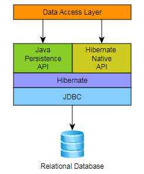
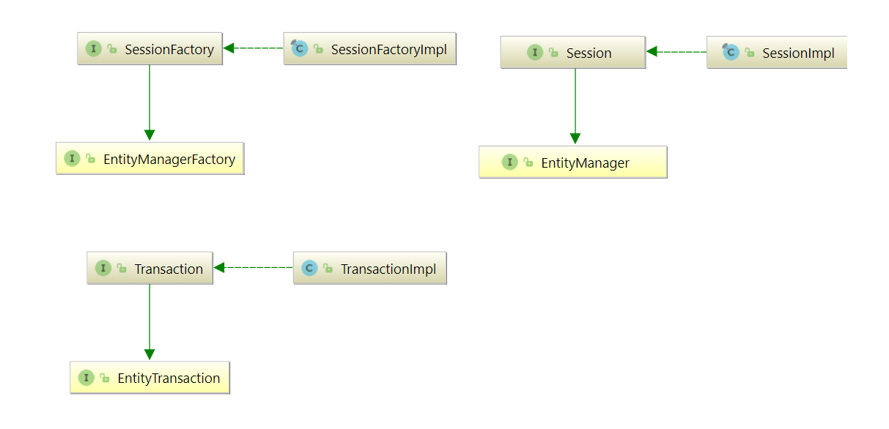

# Hibernate

### Preface
Working with both Object-Oriented software and Relational Databases can be cumbersome and time-consuming. Development costs are significantly higher due to a paradigm mismatch between how data is represented in objects versus relational databases. Hibernate is an Object/Relational Mapping solution for Java environments. The term Object/Relational Mapping refers to the technique of mapping data from an object model representation to a relational data model representation (and vice versa).

Hibernate not only takes care of the mapping from Java classes to database tables (and from Java data types to SQL data types), but also provides data query and retrieval facilities. It can significantly reduce development time otherwise spent with manual data handling in SQL and JDBC. Hibernate’s design goal is to relieve the developer from 95% of common data persistence-related programming tasks by eliminating the need for manual, hand-crafted data processing using SQL and JDBC. However, unlike many other persistence solutions, Hibernate does not hide the power of SQL from you and guarantees that your investment in relational technology and knowledge is as valid as always.

Hibernate may not be the best solution for data-centric applications that only use stored-procedures to implement the business logic in the database, it is most useful with object-oriented domain models and business logic in the Java-based middle-tier. However, Hibernate can certainly help you to remove or encapsulate vendor-specific SQL code and will help with the common task of result set translation from a tabular representation to a graph of objects.

## Architecture

Hibernate, as an ORM solution, effectively "sits between" the Java application data access layer and the Relational Database, as can be seen in the diagram above. The Java application makes use of the Hibernate APIs to load, store, query, etc. its domain data. Here we will introduce the essential Hibernate APIs. This will be a brief introduction; we will discuss these contracts in detail later.

As a Jakarta Persistence provider, Hibernate implements the Java Persistence API specifications and the association between Jakarta Persistence interfaces and Hibernate specific implementations can be visualized in the following diagram:

### SessionFactory
A thread-safe (and immutable) representation of the mapping of the application domain model to a database. Acts as a factory for org.hibernate.Session instances. The EntityManagerFactory is the Jakarta Persistence equivalent of a SessionFactory and basically, those two converge into the same SessionFactory implementation.

A SessionFactory is very expensive to create, so, for any given database, the application should have only one associated SessionFactory. The SessionFactory maintains services that Hibernate uses across all Session(s) such as second level caches, connection pools, transaction system integrations, etc.

### Session

A single-threaded, short-lived object conceptually modeling a "Unit of Work" (PoEAA). In Jakarta Persistence nomenclature, the Session is represented by an EntityManager.

Behind the scenes, the Hibernate Session wraps a JDBC java.sql.Connection and acts as a factory for org.hibernate.Transaction instances. It maintains a generally "repeatable read" persistence context (first level cache) of the application domain model.

### Transaction

A single-threaded, short-lived object used by the application to demarcate individual physical transaction boundaries. EntityTransaction is the Jakarta Persistence equivalent and both act as an abstraction API to isolate the application from the underlying transaction system in use (JDBC or JTA).