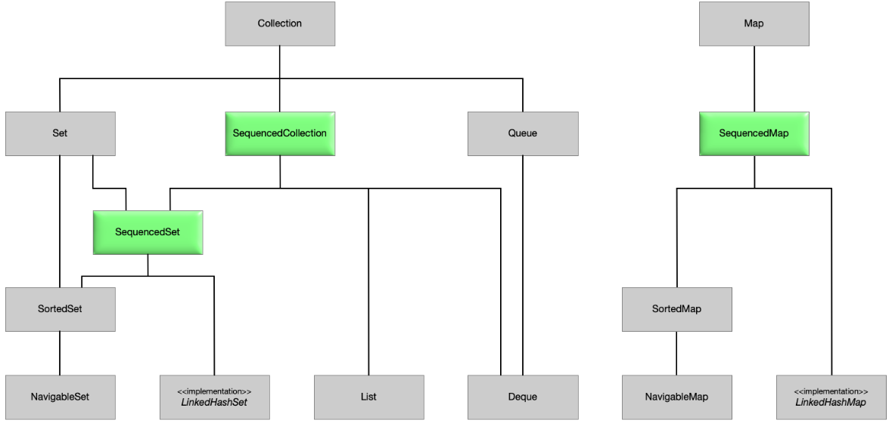

# Java 21 New Features

## Sequenced Collection

Sequenced Collectionlar mavjud Java Collection class/interfacelariga qo'shilgan yangi xususiyat bo'lib, kutubxona
tomonidan taqdim etilgan standard methodlardan foydalangan holda uning birinchi va oxirgi elementiga kirish
imkonini beradi. Shuningdek, oddiy method bilan collectionning teskari yani reversed ko'rinishi olish imkonini beradi.

Ushbu yani JEP-431 yangilanishida collection hierarchyasida 3ta yangi interface taqdim etadi. Ushbu yangi
interfacelari **_SequencedCollection_** , **_SequencedSet_** va **_SequencedMap_**.



Sequenced Interfacelarni qo'shilishidan maqsad collectionning birinchi va oxirgi elementlarni olishning oddiy methodlariga
bo'lgan talabdir. Java 21 dan oldin, Agar ArrayList birinchi va oxirgi elementlarni olishni istasak.

```java
var firstItem = arrayList.iterator().next(); 
var lastItem = arrayList.get(arrayList.size() - 1);
```

Yangi Sequenced collectionlar bilan biz oddiyroq methodlar yordamida xuddi shu narsani qilishimiz mumkin.

```java
var firstItem = arrayList.getFirst();
var lastItem = arrayList.getLast();
```

SequencedCollection interface collectionning teskari ko'rinishda aylantiradigan reversed method bilan birga 
collectionning istalgan uchida elementlarni qo'shish, o'chirish va olish methodlarni taqdim etadi.

```java
default void addFirst(E e) 
default void addLast(E e)

default E getFirst()
default E getLast()

default E removeFirst()
default E removeLast()

SequencedCollection<E> reversed()
```

Quyidagi, dastur ArrayList yaratadi va ushbu Listda yangi sequenced amallarni bajaradi.

```java
ArrayList<Integer> arrayList = new ArrayList<>();

addFirst.add(1); 	// [1]

arrayList.addFirst(0);	// [0, 1]
arrayList.addLast(2);		// [0, 1, 2]

arrayList.getFirst();	// 0
arrayList.getLast();	// 2 

arrayList.reversed();	//[2, 1, 0]
```

[Read More](https://howtodoinjava.com/java/sequenced-collections/)

## Record Pattern

[Read More](https://openjdk.org/jeps/440)

## Virtual Threads

## API Improvements

Java 21 mavjud API-larga bir qator kichik qo'shimchalar bilan birga chiqarildi. Ularni birma bir ko'rib chiqamiz.

### Emoji

Character classi emojilarni aniqlash imkonini beruvchi bir nechta static methodlarni taqdim etdi.

```java
var codePoint = Character.codePointAt("😃", 0);
var isEmoji = Character.isEmoji(codePoint);
// prints "😃 is an emoji: true"
System.out.println("😃 is an emoji: " + isEmoji);
```

### Repeat methods

StringBuilder va StringBuffer classlariga repeat methodlari qo'shildi. Bu sizga yaratilayotgan stringga belgilar 
ketma-ketligini yoki kod nuqtasini bir necha marta takrorlash imkoni beradi.

```java
var builder = new StringBuilder();
builder.append("Hello");
builder.append(", ");
builder.repeat("World", 3);
builder.append("!");
// prints "Hello, WorldWorldWorld!"
System.out.println(builder);
```

### String

String ning yangi indexOf methodlari min va max indexlar qabul qiladi va ushbu orqalidagi charSequencelarni tekshiradi 
va mos bo'lgan index qaytaradi yoki -1 ni.

```java
var hello = "Hello, World";
var earlyCommaIndex = hello.indexOf(",", 0, 3);
// prints "-1"
System.out.println(earlyCommaIndex);
```

Bundan tashqari, Stringning yangi splitWithDelimers method qo'shildi huddi _split_ method kabi ishlaydi. Lekin qaytarilgan
massivda delimlarni ham o'z ichiga oladi. 

```java
var hello = "Hello; World";
var semiColonSplit = hello.splitWithDelimiters(";", 0);
//prints [Hello, ;,  World]
System.out.println(Arrays.toString(semiColonSplit));
```
