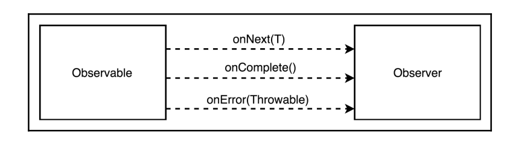

# RxJava

For some time, there was a standard library for reactive programming on Java
platforms—namely RxJava 1.x (see https://github.com/ReactiveX/RxJava for more
details). That library paved the way for reactive programming as we know it in the Java
world today. At the moment, it is not the only library of this kind; we also have Akka
Streams and Project Reactor. The latter is covered in detail in Chapter 4, Project Reactor - the
Foundation for Reactive Apps. So, currently, we have a few options from which we may
choose. Furthermore, RxJava itself has changed a lot with the release of version 2.x.
However, to understand the most basic concepts of reactive programming and the
reasoning behind them, we will be focusing on the most fundamental part of the
RxJava only, on the API, which has not changed since the early versions of the library. All
examples in this section should work fine with both RxJava 1.x and RxJava 2.x.
To enable simultaneous usage in one application classpath, RxJava 2.x and RxJava 1.x have
different group IDs (io.reactivex.rxjava2 versus io.reactivex) and namespaces
(io.reactivex versus rx).


## RxObserver

The RxObserver is pretty similar to the `Iterator`, but instead of calling the next()
method of Iterator, RxObserver would be notified with a new value by the onNext()
callback. And instead of checking whether the result of the hasNext() method is positive,
RxObserver is informed about the end of the stream through the invoked onComplete()
method. That is fine, but what about errors? The Iterator may throw an Exception
during the processing of the next() method, and it would be great to have a mechanism
for an error propagation from the Producer to RxObserver. Let's add a special callback for
that—onError().

---

RxJava-dagi RxObserver interface `Iterator` ga juda o'xshaydi, lekin iteratorning next() method chaqirish o'rniga
RxObserver-ni onNext() method chaqiriladi. Va hasNext() method false natijasi o'rniga esa onComplete() method oqimni
tugatishi haqida xabar beradi. Xatolar uchun esa onError method bor. Iterator next() method bajarish jarayoniga xatoga
yo'l qoyishi mumkin. Shuning uchun xatolarni o'tkazish uchun alohida onError() methodi mavjud.

```java
public interface RxObserver<T> {
    void onNext(T next);
    void onComplete();
    void onError(Exception e);
}
```

This happened because we have just designed an Observer interface, the foundational
concept of RxJava. This interface defines how data flows between every part of a reactive
stream. By being the smallest part of the library, the Observer interface is found
everywhere. The RxObserver is similar to the Observer from the Observer pattern,
as previously described.

The Observable Reactive class is a counterpart to the Subject from the Observer pattern.
As a consequence, Observable plays a role as an events source as it emits items. It has
hundreds of stream transformation methods, as well as dozens of factory methods to
initialize a reactive stream.

A Subscriber abstract class implements the Observer interface and consumes items. It is
also used as a base for the actual Subscriber's implementation. The runtime relation
between Observable and Subscriber is controlled by a Subscription that makes it
possible to check the subscription status and cancel it if needed. This relationship is
illustrated in the following diagram:

---

RxJava-ning asosiy konseptsiyasi bo'lgan Observer interfaceni kordik. Ushbu interface reactive oqimning har bir qismi
o'rtasida ma'lumotlar qanday oqishni belgilaydi.

Observerable Reactive classi objectlarni chiqaradigan eventlar manbai sifatida rol o'ynaydi. Unda yuzlab oqimni
o'zgartirish methodlari, shuningdek, reactive oqimni ishga tushirish uchun o'nlab factory methodlari mavjud.

Subscriber abstract classi oqimdagi elementlarni consume yani istemol qilish uchun ishlatiladi. Observable va Subscriber
o'rtasidagi runtime munosabati Subscriber tomonidan boshqariladi, bu Subscriber holatini tekshirish va kerak bo'lganda
uni bekor qilish imkoni beradi.




In contrast with the Java Stream API, Observable is reusable, and each subscriber will receive the Hello, reactive 
world! event just after the subscription.

---

Java Stream API farqli joyi shundaki Observable qayta ishlatish mumkin.

